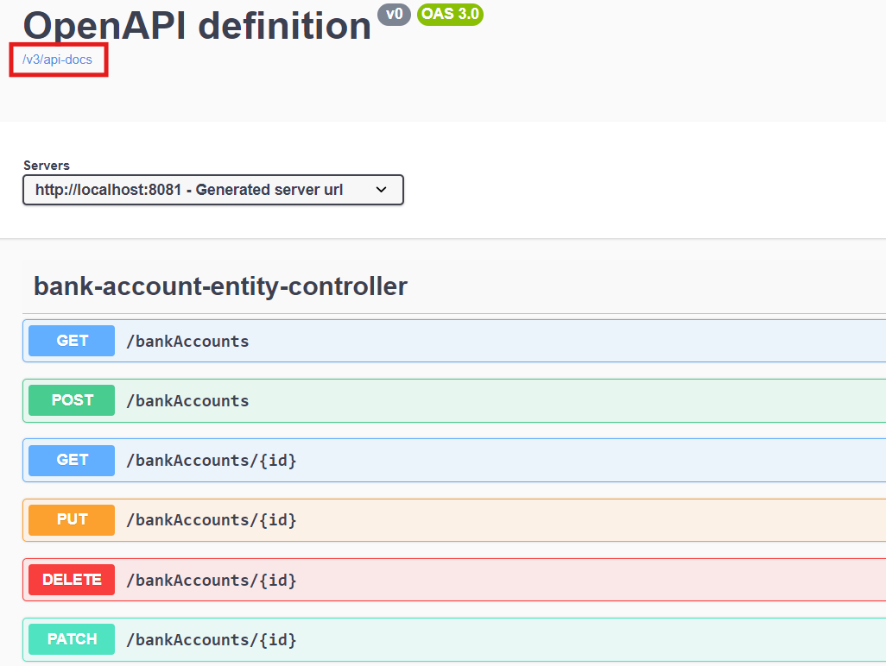

# Développement d'un micro-service qui permet des gérer des comptes bancaires

## Description
Ce projet est un simple micro-service qui permet de gérer des comptes bancaires. Il permet d'afficher les informations d'un compte ou plusieurs, de créer, modifier ou supprimer un compte.

## Structure du projet

```
   src
    ├───main
    │   ├───java
    │   │   └───com
    │   │       └───errami
    │   │           └───bankaccountservice
    │   │               ├───dto
    │   │               │       BankAccountRequestDTO.java
    │   │               │       BankAccountResponseDTO.java
    │   │               │
    │   │               ├───etities
    │   │               │       AccountProjection.java
    │   │               │       BankAccount.java
    │   │               │       Customer.java
    │   │               │
    │   │               ├───enums
    │   │               │       AccountType.java
    │   │               │
    │   │               ├───exeptions
    │   │               │       AccountNotFoundException.java
    │   │               │       GraphQLExceptionHandler.java
    │   │               │
    │   │               ├───mappers
    │   │               │       AccountMapper.java
    │   │               │
    │   │               ├───repositories
    │   │               │       BankAccountRepository.java
    │   │               │       CustomerRepository.java
    │   │               │
    │   │               ├───service
    │   │               │      AccountService.java
    │   │               │      AccountServiceImpl.java
    │   │               │
    │   │               ├───web
    │   │               │       AccountRestController.java
    │   │               │       BankAccountGraphQLController.java
    │   │               │
    │   │               └───BankAccountServiceApplication.java
    │   └───resources
    │       ├───graphql
    │       │       schema.graphqls
    │       │
    │       └───application.properties
    └───test
        └───java
```

## Technologies utilisées
- Java 17
- Spring Boot
- Spring Data JPA
- Spring Web
- Spring GraphQL
- H2 Database
- Lombok

## Fonctionnalités
- Créer un compte
- Modifier un compte
- Supprimer un compte
- Afficher les informations d'un compte ou plusieurs

## Installation

```bash
git clone https://github.com/relmarrakchy/Microservices---Bank-Account-Service.git
cd Microservices---Bank-Account-Service
```

## Les tâches faites
1. Créer l'entité JPA Compte :
```java
@Entity
@Data @NoArgsConstructor @AllArgsConstructor @Builder
public class BankAccount {
    @Id
    @GeneratedValue(generator = "UUID")
    @GenericGenerator(
            name = "UUID",
            strategy = "org.hibernate.id.UUIDGenerator"
    )
    private String id;
    private Date createdAt;
    private Double balance;
    private String currency;
    @Enumerated(EnumType.STRING)
    private AccountType type;
    @ManyToOne
    private Customer customer;
}
```
2. Créer l'interface CompteRepository basée sur Spring Data :
```java
public interface BankAccountRepository extends JpaRepository<BankAccount, String> { }
```
3. Tester la couche DAO :


4. Créer le Web service Restfull qui permet de gérer des comptes :
```java
@RestController
public class AccountRestController {
    private final AccountService accountService;

    public AccountRestController(AccountService accountService) {
        this.accountService = accountService;
    }

    @GetMapping("/bankAccounts")
    public List<BankAccountResponseDTO> getBankAccounts() {
        return accountService.getAllAccounts();
    }

    @GetMapping("/bankAccounts/{id}")
    public BankAccountResponseDTO getBankAccount(@PathVariable String id) {
        return accountService.getAccountById(id);
    }

    @PostMapping("/bankAccounts")
    public BankAccountResponseDTO save(@RequestBody BankAccountRequestDTO requestDTO) {
        return accountService.addAccount(requestDTO);
    }

    @PutMapping("/bankAccounts/{id}")
    public BankAccountResponseDTO update(@PathVariable String id, @RequestBody BankAccountRequestDTO requestDTO) {
        return accountService.updateAccount(id, requestDTO);
    }

    @DeleteMapping("/bankAccounts/{id}")
    public void delete(@PathVariable String id) {
        accountService.deleteAccount(id);
    }
}
```
5. Tester le web micro-service en utilisant un client REST comme Postman :
- **Récuperer tous les comptes :**


- **Récuperer un compte par son id :**


- **Ajouter un compte :**


- **Modifier un compte :**


- **Supprimer un compte :**


6. Générer et tester le documentation Swagger de des API Rest du Web service :
- **Générer le documentation Swagger de des API Rest du Web service :**



- **Tester le documentation Swagger dans Postman :**


8. Créer les DTOs et Mappers :
- **DTOs :**
```java
@Data @NoArgsConstructor @AllArgsConstructor @Builder
public class BankAccountRequestDTO {
    private Double balance;
    private String currency;
    private AccountType type;
}
```
```java
@Data @NoArgsConstructor @AllArgsConstructor @Builder
public class BankAccountResponseDTO {
    private String id;
    private Date createdAt;
    private Double balance;
    private String currency;
    private AccountType type;
    private Customer customer;
}
```
- **Mappers :**
```java
@Component
public class AccountMapper {
    public BankAccount toBankAccount(BankAccountRequestDTO bankAccountRequestDTO) {
        BankAccount bankAccount = new BankAccount();
        BeanUtils.copyProperties(bankAccountRequestDTO, bankAccount);
        return bankAccount;
    }

    public BankAccountResponseDTO fromBankAccount(BankAccount bankAccount) {
        BankAccountResponseDTO bankAccountResponseDTO = new BankAccountResponseDTO();
        BeanUtils.copyProperties(bankAccount, bankAccountResponseDTO);
        return bankAccountResponseDTO;
    }
}
```
9. Créer la couche Service (métier) et du micro service :
```java
public interface AccountService {
    List<BankAccountResponseDTO> getAllAccounts();
    BankAccountResponseDTO getAccountById(String id);
    BankAccountResponseDTO addAccount(BankAccountRequestDTO bankAccountDTO);
    BankAccountResponseDTO updateAccount(String id, BankAccountRequestDTO requestDTO);
    void deleteAccount(String id);
}
```
```java
@Service @Transactional
public class AccountServiceImpl implements AccountService{
    private BankAccountRepository bankAccountRepository;
    private AccountMapper accountMapper;

    public AccountServiceImpl(BankAccountRepository bankAccountRepository, AccountMapper accountMapper) {
        this.bankAccountRepository = bankAccountRepository;
        this.accountMapper = accountMapper;
    }

    @Override
    public List<BankAccountResponseDTO> getAllAccounts() {
        return bankAccountRepository.findAll().stream()
                .map(accountMapper::fromBankAccount)
                .collect(Collectors.toList());
    }

    @Override
    public BankAccountResponseDTO getAccountById(String id) {
        BankAccount bankAccount = bankAccountRepository.findById(id)
                .orElseThrow(() -> new RuntimeException(String.format("Bank account with id %s not found", id)));
        return accountMapper.fromBankAccount(bankAccount);
    }

    @Override
    public BankAccountResponseDTO addAccount(BankAccountRequestDTO bankAccountDTO) {
        BankAccount bankAccount = accountMapper.toBankAccount(bankAccountDTO);
        BankAccount savedBankAccount = bankAccountRepository.save(bankAccount);
        BankAccountResponseDTO bankAccountResponseDTO = accountMapper.fromBankAccount(savedBankAccount);
        return bankAccountResponseDTO;
    }

    @Override
    public BankAccountResponseDTO updateAccount(String id, BankAccountRequestDTO requestDTO) {
        BankAccount bankAccount = bankAccountRepository.findById(id)
                .orElseThrow(() -> new RuntimeException(String.format("Bank account with id %s not found", id)));

        if (requestDTO.getBalance() != null) bankAccount.setBalance(requestDTO.getBalance());
        if (requestDTO.getCurrency() != null) bankAccount.setCurrency(requestDTO.getCurrency());
        if (requestDTO.getType() != null) bankAccount.setType(requestDTO.getType());
        bankAccount.setCreatedAt(new Date());

        BankAccount updatedBankAccount = bankAccountRepository.save(bankAccount);
        return accountMapper.fromBankAccount(updatedBankAccount);
    }

    @Override
    public void deleteAccount(String id) {
        bankAccountRepository.deleteById(id);
    }
}
```
10. Créer un Web service GraphQL pour ce Micro-service :
```java
@Controller
public class BankAccountGraphQLController {
    private BankAccountRepository bankAccountRepository;
    private AccountService accountService;

    public BankAccountGraphQLController(BankAccountRepository bankAccountRepository, AccountService accountService) {
        this.bankAccountRepository = bankAccountRepository;
        this.accountService = accountService;
    }

    @QueryMapping
    public List<BankAccount> accountsList() {
        return bankAccountRepository.findAll();
    }

    @QueryMapping
    public BankAccount getBankAccountById(@Argument String id) {
        return bankAccountRepository.findById(id)
                .orElseThrow(() -> new RuntimeException(String.format("Bank account with id %s not found", id)));
    }

    @MutationMapping
    public BankAccountResponseDTO addAccount(@Argument BankAccountRequestDTO bankAccount) {
        return accountService.addAccount(bankAccount);
    }

    @MutationMapping
    public BankAccountResponseDTO updateAccount(@Argument String id, @Argument BankAccountRequestDTO bankAccount) {
        return accountService.updateAccount(id, bankAccount);
    }

    @MutationMapping
    public void deleteAccount(@Argument String id) {
        accountService.deleteAccount(id);
    }
}
```


